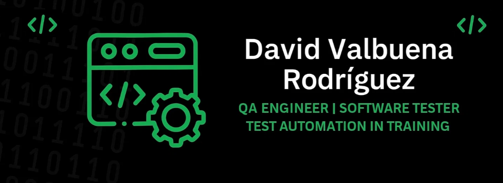

# David Valbuena Rodríguez

# 👋 Hi, I’m David Valbuena Rodríguez  

💻 **QA Engineer | Software Tester | Junior Developer in training**  

I am a QA professional with experience in **functional testing, test case design, and API validation**.  
Currently, I’m specializing in **test automation** and learning **Python and Ruby** to strengthen my technical skills.  
I have an **intermediate level of English (B1)** which allows me to work in international and multicultural teams.  

---

## 🚀 Skills & Tools

- 🧪 **Functional & Regression Testing**  
- 🔗 **API Testing**:    
- 🤖 **Automation in progress**:      
- ⚡ **Load Testing**:   
- 🐞 **Defect Tracking**:    
- 🗄️ **Databases**:   
- ☁️ **Cloud**:    
- 📋 **Agile**:   

---

## 📂 Featured Projects
🔹 **QA Project - Urban Grocers API**  
Automated tests with Python & `pytest`, validating kit creation and management in the app.  
📌 [View Repository](https://github.com/davidvalbuenarod/urban-grocers-api)  

🔹 **QA Project - Taxi Application**  
Log analysis, SQL queries, and ER diagram review to ensure data integrity.  
📌 [View Repository](https://github.com/davidvalbuenarod/taxi-app-db)  

---

## 🌱 Currently Learning
- Programming with **Python and Ruby**  
- Best practices in **test automation**  
- Testing frameworks like **Selenium, Pytest**  

---

## 💼 Work Experience
**Foundever (2024 – Present)**  
*Customer Experience & QA Support*  
- Applied **test case execution** and **bug reporting** in real customer workflows.  
- Improved issue tracking and communication between development and support teams.  
- Gained hands-on experience with **tools like Jira, SQL queries, and QA methodologies**.  

---

## 📚 Education
**TripleTen Bootcamp – QA Engineer (2024 – 2025)**  
- Manual & Automated Testing  
- SQL & Database Queries  
- API Testing (Postman, Pytest)  
- Test Case Design & Reporting  

---

## 🌎 Languages
- **Spanish**: Native  
- **English**: Intermediate (B1-B2)  

---

## 📫 Let’s Connect
- 🌐   
- 💻   
- ✉️ davidrodriguez290@gmail.com  

---

⭐️ *Always open to new challenges and opportunities in QA and test automation.*  

